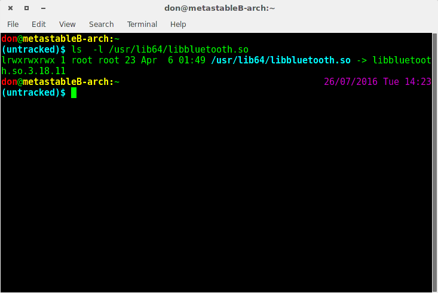
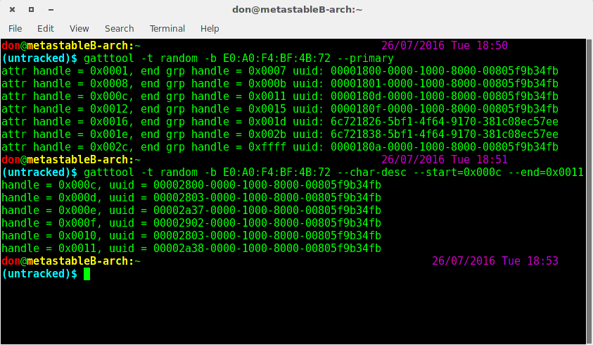

Index
- Setting up bluetooth dongle and bluez
- Basics of BLE/GATT: services, characteristcs, gattprofiel, read write, notifications
- Intro to generic where you outline the difference between MIO Global Fuse and sensor tag (No standard services in sensor tag)
- Generic set of steps that can be followed: interactive and non interactve
 (with MIO Global Fuse as example)
- Sensor Tag

# Reading Heart Rate from Health Band both interactively and non interactively: BLE, Bluez

1. make sure you have a bluetooth card or dongle with bluetooth 4.0(BLE) support.
2. Make sure you have the correct version of Bluez installed.
There are different ways of doing this. On debian based systems you can use `dpkg` to print out bluez version. Try something like:

    dpkg --status bluez | grep '^Version:'

Alternatively, bluez provides a shared library libbluetooth.so located in /usr/lib64/. You can look for the version in the symlink here. Specifically, use

    ls -al /usr/lib64/libbluetooth.so 

My version of bluez is 3.18. Make sure your version of bluez has BLE support.

3. Next we need to make sure that the hci device (our bluetooth dongle) is up. Run
    $ hciconfig 

As you can see, the third line of the output indicates that my hcidevice is down. Run the following to bring it back up.

    $ hciconfig hci0 up

Your device shoudl be up now.

If you are experience problems with the device itself, check dmesg for error messages. I had some issues with some bluetooth dongles. The fixes to the issues are certainly device specific.

After you have your bluetooth dongle working, we can run a few scans to check if everything is working fine. Make sure that at least a few Bluetooth devices are within range and run:
    
    $ hcitool scan

to scan for bluetooth devices nearby. `hcitool` is part of the bluez package and the `scan` command scans for regular bluetooth devices and not specifically BLE devices.

Now to scan for BLE devices, we use the `lescan` option. Run,

    $ hcitool lescan 

to scan for BLE devices. Make sure your BLE devices are turned on.

You can ignore teh unknown devicees in my output. 

Since we are going to work with the Mio Global-Fuse for this example, note its MAC address provided in the lescan output. My device has a MAC id: A0:E6:F8:B6:F5:07. You have to replace this with the MAC id of your specific device.

Before we get get on to using the Mio Global Fuse and get down to reading the heartrate values, it is important to understand a little about [General Attribute Profile](https://www.bluetooth.com/specifications/adopted-specifications), [Services](https://developer.bluetooth.org/gatt/services/Pages/ServicesHome.aspx), [Characterstics](https://developer.bluetooth.org/gatt/characteristics/Pages/CharacteristicsHome.aspx) and [characterstics configuration](https://developer.bluetooth.org/gatt/descriptors/Pages/DescriptorViewer.aspx?u=org.bluetooth.descriptor.gatt.client_characteristic_configuration.xml). You don't really need to dig deep into these and you probably can get away with a basic understanding. I for one, read just about enough for me to understand what these are and that has been enough for me.

For the lazy ones, the *characterstics* are defined attribute types that contain a single logical value. For example, the battery level, heart rate or say age. The provided link lists all adopted characterstics. Each characterstic has a unique ID (assigned number) assigned to it which we will use later to interact with the BLE device. Further, each characterstic has a certain set of configuration options.

For example, consider the [navigation 0x2a58](https://developer.bluetooth.org/gatt/characteristics/Pages/CharacteristicViewer.aspx?u=org.bluetooth.characteristic.navigation.xml) characterstic specification. It lists a row whose name is _flags_. It is a mandatory 16 bit field, meaning that any device that supports this characterstic will have this field. Further, the additional information section has information regarding what indivifual bit values mean. Later, we will see how we can modify these bits.

A group of characterstics that share a logical relation form a service. For example the characterstics that provide information about a device forms the [device information service](https://developer.bluetooth.org/gatt/services/Pages/ServiceViewer.aspx?u=org.bluetooth.service.device_information.xml). As you can see, the device information service has characterstics like manufacture_name_string, nodel_number_string etc. Note that, like characterstics, services are also assigned a UUID, which we will later use to identify the characterstic on the devices.

Remember that the listed characterstics and services are not exhaustive and you will certainly find other UUIDs not mapped to any characterstic or service. These are manufacture specifc services/characterstics.

For our Mio Glubal-Fuse, we will first identify if the [Battery Service](https://developer.bluetooth.org/gatt/services/Pages/ServiceViewer.aspx?u=org.bluetooth.service.battery_service.xml) is available on the device. If it is, we will read the [Batter Level](https://developer.bluetooth.org/gatt/services/Pages/ServiceViewer.aspx?u=org.bluetooth.service.battery_service.xml) characterstic off the service. 

To interact with a BLE device, we use the Bluez's `gatttool`. `gatttool` has an interactive mode which we will be starting with for convinience. Later I will show you how you can use the gatttool in non interactive mode, which might come in handy when using from within some shell scripts or an `exec()`.

Startup the gattool for interacting with Mio Global-Fuse. My Mio Global-Fuse has the MAC addrss E0:A0:F4:BF:4B:72. Make sure to replace this with your own MAC address. The exact command to run gatttool in interactive mode is:

    $ gatttool -t random -b E0:A0:F4:BF:4B:72 -I

the `-t` flag sets the BLE device address type, which for our case is `random`. The default for most devices is `public`.

The `-I` flag stars the interactive mode of gatttool. Once you are in the interactive mode, a new prompt will show up with the device MAC address mentioned. To connect type `connect`. On a successful connection, the color of the MAC address in the prompt shoud change.

To view the primary services running on the device, we type the `primary` command.

    $ [E0:A0:F4:BF:4B:72][LE]> primary

We will see a list of services running on the BLE device and their UUIDs. . 

Our objective is to see what characterstics the battery service provides. For that we need to first identify the battery service. We look at the documentation [here](https://developer.bluetooth.org/gatt/services/Pages/ServiceViewer.aspx?u=org.bluetooth.service.battery_service.xml) and note that the UUID (Assigned Number) is 0x180F. Correspondingly we identify the line in the `primary` output which starts with the same UUID. You can ignore the remaining part of the UUID.

The line in concerned is:
 
    attr handle: 0x0012, end grp handle: 0x0015 uuid: 0000180f-0000-1000-8000-00805f9b34fb

We have identified our service. Now we need to look at the documentation and figure out what are the characterestics this service provides. [Here](https://developer.bluetooth.org/gatt/services/Pages/ServiceViewer.aspx?u=org.bluetooth.service.battery_service.xml) in the service characteristics column, we see that, we can see that the Battery service provides a Battery Level service with a mandatory read property.

From the characterstics page of [battery level](https://developer.bluetooth.org/gatt/characteristics/Pages/CharacteristicViewer.aspx?u=org.bluetooth.characteristic.battery_level.xml) we note that the UUID of this characterstic is 0X2A19. 

Now we check what characteristics are provided by the device for this service and verify whether the battery level is one of them. To do that we need the `attr handle` and `end grp handle` as returned by the `primary` command for the battery service. For my output the attr handle is 0x0012 and the end grp handle is 0x0015.

To read the characteristics of any service, we obtain the attr handle and end grp handle and execute the floowing at the prompt

    $ char-desc attr-handle end-grp-handle
    $ # For our case
    $ char-desc 0x0012 0x0015

This will describe the characteristics between 0x0012 and 0x0015. 

The displayed output are the uuid and handles for the characteristics of the battery service. As you can see form my output, there may be unrecognised UUID's. What we are looking for is the line with the battery_levl characteristics UUID (0x2a19).

Note down the handle corresponding to this UUID. For my particular case, the handle is 0x0014. Note that each charaterstic is identified by a handle and all operation on that characterstic is done via the handle. Also note that handles are not unique or simillar accross devices for the same charaterstics. For the same characterstic, handles can be different accross devices. Also, multiple instances of a characterstic can be existing on a device (as part of different services). All of them will have different handles.

To read from a handle, we use the `char-read-hnd` command with the handle as a parameter. For my carticular case, I run:

    $ char-read-hnd 0x0014

Make sure that the characterstic propery includes the ability to be read. Not all characterstics can be read, as we will see with the heart rate service.

## Reading Heart Rate

By this point we have an idea about a general procedure we can follow to interact with BLE devices. 

  1. Identify the UUID of the service which we are concerned about
  2. Run gattool in interactive mode and check the primary services to  see if the UUID exists.
  3. Again go to the documentaiton to find the characterestics offered by the service.
  4. Run `char-desc` to find out the characteristics offered by our device and note down the handle for the characteristic we are looking for.
  5. Use the gatttool commands for reading (char-read-hnd) or writing (char-write-hnd) to interact with the service. 

For reading the heart rate, we look through the list of [adopted services](https://developer.bluetooth.org/gatt/services/Pages/ServicesHome.aspx) and identify the Heart Rate Service (0x180D) as a candidate for exploration. We look at the output from the primary command and notice that the service indeed is probided by Mio Global Fuse.

    attr handle: 0x000c, end grp handle: 0x0011 uuid: 0000180d-0000-1000-8000-00805f9b34fb

Now, looking under the Service Characteristcs table [here](https://developer.bluetooth.org/gatt/services/Pages/ServiceViewer.aspx?u=org.bluetooth.service.heart_rate.xml) we see that the heart rate service provides teh Hear Rate Measurement (0x2a37) characteristics. The properties of the Heart Rate Measurement though states that the `Read` property is excludded. Bummer!

Note that the notification property is included. What this means is that we can configure the device to send us periodic notification for this characteristic. Looking at the documentation for [Client Characteristic Configuration(0x2902)](https://developer.bluetooth.org/gatt/descriptors/Pages/DescriptorViewer.aspx?u=org.bluetooth.descriptor.gatt.client_characteristic_configuration.xml) we see in the value fields, that setting bit 0 as 1 enables notification.

That is, we need to find out the handle for the notification discriptor and write 1 to the 0th bit.

Again, running char-desc on the corresponding handles for the service (attr handle 0x000c and end grp handle 0x0011) we see the characteristics provided are:

We can see the notification discriptor(0x2902) and the heart rate measurement (0x2a37) with handles 0x000f and 0x000e respectively. We need to write 0x0001 to the notification handle. The values written are in big endian(?) so we need to write 0x0100. To write to a handle, we use the `char-write-req` command.

    $ char-write-req [handle] [value]
    $ # For my case
    $ char-write-req 0x000f 0100

The device should be switched on for the notifications to be received. Notice the notification handle 0x000e, which correesponds to the heart rate measurement 0x2a37.

The value supplied is some what cryptic and I could not really figure out what it means. After some digging, I concluded that the second column is the heart rate value in hex. 

For example:

    Notification handle = 0x000e value: 10 53 e4 02 

The heartrate value here is 0x53 which when coverted to decimal turns out to be 83.

To disable the notification, write 0000 to the notifcation handle as indicated in the documentation.

Type exit at the prompt to exit from the interactive mode.

## Non Interactive Mode

The gatttool can also be used in a non interactive mode though I have had some stability issues with it. Its either that or that I don't really understand how to use gatttool yet.

Anywho, I `gatttool --help-gatt` lists the commands that are provided by the gatttool as command line.

Lets try to read the heartrate off the Mio Global Fuse using the command line. First we need to see the primary characteristics.

     $ gatttool -t random -b [MAC] --primary
     $ # For my case
     $ gatttool -t random -b E0:A0:F4:BF:4B:72 --primary

Now we view the characterstics of the heart rate service using the handles provided from the previous command. In `gatttool --help-params` we see that the start and end handles are provided with the --start and --end arguments.

     $ gatttool -t random -b E0:A0:F4:BF:4B:72 --char-desc --start=0x000c --end=0x0011 

From the returned output, we notice that the notification service 0x2902 has a handle 0x000f and the heart rate measurement is at 0x000e. Again refering to the help in `gatttool --help-char-read-write` we notice that the `char-write-req` is the argument we use to write with a response.

We need to figure out how we are going to specify the handle to wirte to and the value to write. Looking at `gatttool --help-char-read-write` we see that the handle is provided with the `--handle` flag and the value using the `--value` flag.

Also, we need our command to wait for the notifications from the device rather than exit prematurely. In `gatttool --help-char-read-write`, we notice that `--listen` flag is used to listen for indications and notifications.

Therefore our command has the following parts

    $ # gatttool -t random -b [MAC] : to connect to the device
    $ # --char-write-req: to specify that we are going to write
    $ # --value=0100    : The value we want to write
    $ # --hanle=0x000f  : The notificaiton handle
    $ # --listen        : to instruct gatttool to listen for notifications
    $
    $ # therefore, for mycase, the final command becomes
    $
    $ gatttool -t random -b E0:A0:F4:BF:4B:72 --char-write-req --handle=0x000f --value=0100 --listen

And voila! you have notifications!

## RAW OUTPUT

### gatttool
     don@metastableB-arch:~                                      26/07/2016 Tue 17:54
     (untracked)$ gatttool -t random -b E0:A0:F4:BF:4B:72 -I
     [E0:A0:F4:BF:4B:72][LE]> connect
     Attempting to connect to E0:A0:F4:BF:4B:72
     Connection successful
     [E0:A0:F4:BF:4B:72][LE]> primary
     attr handle: 0x0001, end grp handle: 0x0007 uuid: 00001800-0000-1000-8000-00805f9b34fb
     attr handle: 0x0008, end grp handle: 0x000b uuid: 00001801-0000-1000-8000-00805f9b34fb
     attr handle: 0x000c, end grp handle: 0x0011 uuid: 0000180d-0000-1000-8000-00805f9b34fb
     attr handle: 0x0012, end grp handle: 0x0015 uuid: 0000180f-0000-1000-8000-00805f9b34fb
     attr handle: 0x0016, end grp handle: 0x001d uuid: 6c721826-5bf1-4f64-9170-381c08ec57ee
     attr handle: 0x001e, end grp handle: 0x002b uuid: 6c721838-5bf1-4f64-9170-381c08ec57ee
     attr handle: 0x002c, end grp handle: 0xffff uuid: 0000180a-0000-1000-8000-00805f9b34fb
     [E0:A0:F4:BF:4B:72][LE]> char-desc 0x0012 0x0015
     handle: 0x0012, uuid: 00002800-0000-1000-8000-00805f9b34fb
     handle: 0x0013, uuid: 00002803-0000-1000-8000-00805f9b34fb
     handle: 0x0014, uuid: 00002a19-0000-1000-8000-00805f9b34fb
     handle: 0x0015, uuid: 00002902-0000-1000-8000-00805f9b34fb
     [E0:A0:F4:BF:4B:72][LE]> 
     [E0:A0:F4:BF:4B:72][LE]> char-read-hnd 0x0014
     Characteristic value/descriptor: 25 
     [E0:A0:F4:BF:4B:72][LE]> 
     [E0:A0:F4:BF:4B:72][LE]> char-desc 0x000c 0x0011
     handle: 0x000c, uuid: 00002800-0000-1000-8000-00805f9b34fb
     handle: 0x000d, uuid: 00002803-0000-1000-8000-00805f9b34fb
     handle: 0x000e, uuid: 00002a37-0000-1000-8000-00805f9b34fb
     handle: 0x000f, uuid: 00002902-0000-1000-8000-00805f9b34fb
     handle: 0x0010, uuid: 00002803-0000-1000-8000-00805f9b34fb
     handle: 0x0011, uuid: 00002a38-0000-1000-8000-00805f9b34fb
     [E0:A0:F4:BF:4B:72][LE]> char-write-req 0x000f 0100
     Characteristic value was written successfully
     Notification handle = 0x000e value: 00 00 
     Notification handle = 0x000e value: 00 00 
     Notification handle = 0x000e value: 00 00 
     Notification handle = 0x000e value: 00 00 
     Notification handle = 0x000e value: 00 00 
     Notification handle = 0x000e value: 00 00 
     Notification handle = 0x000e value: 00 00 
     Notification handle = 0x000e value: 00 00 
     Notification handle = 0x000e value: 10 56 ca 02 
     Notification handle = 0x000e value: 10 53 e4 02 
     Notification handle = 0x000e value: 10 50 00 03 00 03 
     Notification handle = 0x000e value: 10 4e 14 03 
     Notification handle = 0x000e value: 10 4c 28 03 
     Notification handle = 0x000e value: 10 4a 3e 03 
     Notification handle = 0x000e value: 10 49 4a 03 4a 03 
     Notification handle = 0x000e value: 10 49 4a 03 
     [E0:A0:F4:BF:4B:72][LE]> char-write-req 0x000f 0000
     Characteristic value was written successfully
     [E0:A0:F4:BF:4B:72][LE]> 

# NON interactive

    don@metastableB-arch:~                          26/07/2016 Tue 19:08
    (untracked)$ gatttool -t random -b E0:A0:F4:BF:4B:72 --primary
    attr handle = 0x0001, end grp handle = 0x0007 uuid: 00001800-0000-1000-8000-00805f9b34fb
    attr handle = 0x0008, end grp handle = 0x000b uuid: 00001801-0000-1000-8000-00805f9b34fb
    attr handle = 0x000c, end grp handle = 0x0011 uuid: 0000180d-0000-1000-8000-00805f9b34fb
    attr handle = 0x0012, end grp handle = 0x0015 uuid: 0000180f-0000-1000-8000-00805f9b34fb
    attr handle = 0x0016, end grp handle = 0x001d uuid: 6c721826-5bf1-4f64-9170-381c08ec57ee
    attr handle = 0x001e, end grp handle = 0x002b uuid: 6c721838-5bf1-4f64-9170-381c08ec57ee
    attr handle = 0x002c, end grp handle = 0xffff uuid: 0000180a-0000-1000-8000-00805f9b34fb
    don@metastableB-arch:~                                                                                                   26/07/2016 Tue 19:09
    (untracked)$ gatttool -t random -b E0:A0:F4:BF:4B:72 --char-desc --start=0x000c --end=0x0011
    handle = 0x000c, uuid = 00002800-0000-1000-8000-00805f9b34fb
    handle = 0x000d, uuid = 00002803-0000-1000-8000-00805f9b34fb
    handle = 0x000e, uuid = 00002a37-0000-1000-8000-00805f9b34fb
    handle = 0x000f, uuid = 00002902-0000-1000-8000-00805f9b34fb
    handle = 0x0010, uuid = 00002803-0000-1000-8000-00805f9b34fb
    handle = 0x0011, uuid = 00002a38-0000-1000-8000-00805f9b34fb
    don@metastableB-arch:~                                                                                                   26/07/2016 Tue 19:09
    (untracked)$ gatttool -t random -b E0:A0:F4:BF:4B:72 --char-write-req --handle=0x000f --value=0000 --listen
    Characteristic value was written successfully

     Notification handle = 0x000e value: 00 00 
     Notification handle = 0x000e value: 00 00 
     Notification handle = 0x000e value: 00 00 
     Notification handle = 0x000e value: 00 00 
     Notification handle = 0x000e value: 00 00 
     Notification handle = 0x000e value: 00 00 
     Notification handle = 0x000e value: 00 00 
     Notification handle = 0x000e value: 00 00 
     Notification handle = 0x000e value: 10 56 ca 02 
     Notification handle = 0x000e value: 10 53 e4 02 
     Notification handle = 0x000e value: 10 50 00 03 00 03 
     Notification handle = 0x000e value: 10 4e 14 03 
