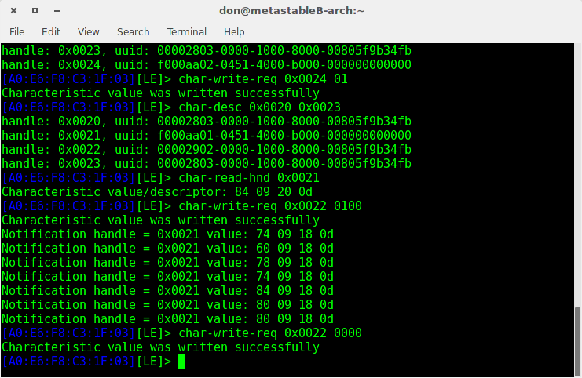

Unlike the mio global fuse, we are not able to identify any of the services from the [adopted services list](https://developer.bluetooth.org/gatt/services/Pages/ServicesHome.aspx) for BLE. Thankfully, TI provides their own documentation for the CC2650 sensor tag. It can be found [here](http://processors.wiki.ti.com/index.php/CC2650_SensorTag_User's_Guide). 

For the purpose of this demonstration, I am going to read the data from the IR Temperature sensor provided in the Sensor Tag as well as listen through notifications. I will be demonstrating this via the gatttool interactive mode as well as the command line mode.

[SETTING UP BLE DEVICES and making sure hci0 is up]

Firstly, we obtain the MAC address of our device by doing a scan for LE devices.

    $ hcitool lescan

I have a couple of sensor tags at the moment and I will be using the one with A0:E6:F8:C3:1F:03 as the MAC for this demo.

Now that we have the MAC address, we fireup gatttool and connect to the device. 

    $ gatttool -b A0:E6:F8:C3:1F:03 -I
    [A0:E6:F8:C3:1F:03][LE]> connect

As I mentioned above, the sensor tag does not provide any service that is part of the standard gatt profile. We switch to the [TI documentation](http://processors.wiki.ti.com/index.php/CC2650_SensorTag_User's_Guide) now.

Here, in the IR Temperature Sensor section, we note that the data is provided from UUID AA01 and the characterstic has Read and Notification access (R/N). Thhe data is 4 bytes long, the first two bytes being the object temperature and the last two bytes being the ambience temperature. 

Notification is configured at 2902 and data collection is configured at aa02. You can configure period/resolution at aa03.

Therefore, for reading the data we will have to
1. Find out the handle correspondig to UUID AA02 and write 01 to enable data collection
2. Find out the handle correspondign to UUID AA01 and read the data.
3. enable notifications at 2902

Use the `characteristics` command to get the information of the characterists. In it find the line corresponding to UUID aa02, our data configuration

    handle: 0x0023, char properties: 0x0a, char value handle: 0x0024, uuid: f000aa02-0451-4000-b000-000000000000

We notice that the handle is 0x0023 and that the next characteristic starts at handle 0x0025. Hmm, what is in between ?

Lets look at the charecteristcs description from 0x0023 to 0x0024

    $ char-desc 0x0023 0x0024

In the response, we see that the UUID aa02, corresponding to our configuration option has an handle 0x0024.

    handle: 0x0023, uuid: 00002803-0000-1000-8000-00805f9b34fb
    handle: 0x0024, uuid: f000aa02-0451-4000-b000-000000000000

Now we need to write the value 0x01 to the handle 0x0024. 

For that we use `char-write-req` as
    
    $ char-write-req 0x0024 01

Now that we have enabled the sensor and started collecting data, we can read it by proceeding to step 2. For that we need to identify the handle for the UUID aa01.

Looking at the `characteristcs` output, we see that the aa01 command has the following line.
    
    handle: 0x0020, char properties: 0x12, char value handle: 0x0021, uuid: f000aa01-0451-4000-b000-000000000000

The start handle is 0x0020 and the next characteristics starts at 0x0023. Lets again see the discription of characterists in between 0x0020 and 0x0022.

    handle: 0x0020, uuid: 00002803-0000-1000-8000-00805f9b34fb
    handle: 0x0021, uuid: f000aa01-0451-4000-b000-000000000000
    handle: 0x0022, uuid: 00002902-0000-1000-8000-00805f9b34fb
    

I get the above output. Notice the UUID aa01 with handle 0x0021 and UUID 2902 with handle 0x0022. The former is our data characteristcs and we will use this to read the temperature data off the IR sensor. The later on the other hand is the notification discriptor.

First we try to read the data. We should be getting a 2 Byte (16 bit) response. We run the following command to read the data.

    $ char-read-hnd 0x0021

I get the following response
    
    Characteristic value/descriptor: 84 09 20 0d 

These values are again a little cryptic and we need to use the function provided in the documentation to obtain the temperature in degree celcious. The first two bytes (84 09) are teh Ambient Temperature values and the second two bytes (20 0d) are the object temperature.

Finally, to enable notification, we write 0001 to the notification handle, 0x0022. SInce the BLE is byte endian, we actually write 0100.

    $ char-write-req 0x0022 0100

    void sensorTmp007Convert(uint16_t rawAmbTemp, uint16_t rawObjTemp, float *tAmb, float *tObj)
    {
      const float SCALE_LSB = 0.03125;
      float t;
      int it;
     
      it = (int)((rawObjTemp) >> 2);
      t = ((float)(it)) * SCALE_LSB;
      *tObj = t;
     
      it = (int)((rawAmbTemp) >> 2);
      t = (float)it;
      *tTgt = t * SCALE_LSB;
    }

It is again worthwhile to note that multiple notification characteristics exist with differnet handles for different sensors and you have to make sure that you are writitng to the correct handle.

# Non Interactive

The non interactive mode is simillar in logic to the interactive mode. I will describe the commands here and not divulge in to the details.

#### Read characterstics

    gatttool -b A0:E6:F8:C3:1F:03 --characteristics

After reading the characteristics identify the configuration characterstic and read the characterstic description between the handles of that and the next listed characterstics.

    handle = 0x0020, char properties = 0x12, char value handle = 0x0021, uuid = f000aa01-0451-4000-b000-000000000000
    handle = 0x0023, char properties = 0x0a, char value handle = 0x0024, uuid = f000aa02-0451-4000-b000-000000000000
    handle = 0x0025, char properties = 0x0a, char value handle = 0x0026, uuid = f000aa03-0451-4000-b000-000000000000

For my case, the handle corresponding to aa02 (configuration) is 0x0023 and the next characterstic has a handle 0x0025. I am going to read the characterstics description between these two.

    $ gatttool -b A0:E6:F8:C3:1F:03 --char-desc --start=0x0023 --end=0x0025

    handle = 0x0023, uuid = 00002803-0000-1000-8000-00805f9b34fb
    handle = 0x0024, uuid = f000aa02-0451-4000-b000-000000000000
    handle = 0x0025, uuid = 00002803-0000-1000-8000-00805f9b34fb

The handle corresponding to aa02 is 0x0024 so I write 0x01 to it.

    $ gatttool -b A0:E6:F8:C3:1F:03 --char-write-req --handle=0x0024 --value=01

After the value has been written successfully, we use characteristic descrption to view the handles between aa01 (the data) and the next characterstic.

For my case the aa01 char has a handle 0x0020 and the next char has the handle 0x0023. I look for the description between 0x0020 and 0x0023

    handle = 0x0020, uuid = 00002803-0000-1000-8000-00805f9b34fb
    handle = 0x0021, uuid = f000aa01-0451-4000-b000-000000000000
    handle = 0x0022, uuid = 00002902-0000-1000-8000-00805f9b34fb
    handle = 0x0023, uuid = 00002803-0000-1000-8000-00805f9b34fb
    handle = 0x0024, uuid = f000aa02-0451-4000-b000-000000000000

I notice that the handle corresponding to aa01 is 0x0021. We can now read the data off this handle.

     $ gatttool -b A0:E6:F8:C3:1F:03 --char-read --handle=0x0021

Sometimes I have noticed that the sensor tag returns all zeros even after I have configured the sensor to take readings. It acts as if the command was never issued. It seems that if a specific amount of time is elapsed after the connection is broken (which happens as the command terminates), the sensor tag goes to power saving mode and turns off all sensors. This can be clearly seen when we try to enable the notificatoin.

From the prvious char disc of UUID aa01, we see that the UUID 2902 (notification) has a handle 0x0022. To enable notifications, we write 0x0001 (i.e. 0100 due to the byte inversion) to the handle and listen for the notifications with the --listen flag.

    $ gatttool -b A0:E6:F8:C3:1F:03 --char-write-req --handle=0x0022 --value=0100 --listen

You will most probably observe that nothing really happens - our prompt enters a sort of wait state even after the value was written successfully. This again, is as i suspect because the timeout has occured after the connection breakage. To get around this, execute the configuration and notification command in one go. 
    
    gatttool -b A0:E6:F8:C3:1F:03 --char-write-req --handle=0x0024 --value=01; gatttool -b A0:E6:F8:C3:1F:03 --char-write-req --handle=0x0022 --value=0100 --listen

You should now receive the correct values from the handle corresponding to aa01.

# RAW
gatttool interactive

don@metastableB-arch:~
(untracked)$ gatttool -b A0:E6:F8:C3:1F:03 -I
[A0:E6:F8:C3:1F:03][LE]> connect
Attempting to connect to A0:E6:F8:C3:1F:03
Connection successful
[A0:E6:F8:C3:1F:03][LE]> characteristics 
handle: 0x0002, char properties: 0x02, char value handle: 0x0003, uuid: 00002a00-0000-1000-8000-00805f9b34fb
handle: 0x0004, char properties: 0x02, char value handle: 0x0005, uuid: 00002a01-0000-1000-8000-00805f9b34fb
handle: 0x0006, char properties: 0x02, char value handle: 0x0007, uuid: 00002a04-0000-1000-8000-00805f9b34fb
handle: 0x0009, char properties: 0x20, char value handle: 0x000a, uuid: 00002a05-0000-1000-8000-00805f9b34fb
handle: 0x000d, char properties: 0x02, char value handle: 0x000e, uuid: 00002a23-0000-1000-8000-00805f9b34fb
handle: 0x000f, char properties: 0x02, char value handle: 0x0010, uuid: 00002a24-0000-1000-8000-00805f9b34fb
handle: 0x0011, char properties: 0x02, char value handle: 0x0012, uuid: 00002a25-0000-1000-8000-00805f9b34fb
handle: 0x0013, char properties: 0x02, char value handle: 0x0014, uuid: 00002a26-0000-1000-8000-00805f9b34fb
handle: 0x0015, char properties: 0x02, char value handle: 0x0016, uuid: 00002a27-0000-1000-8000-00805f9b34fb
handle: 0x0017, char properties: 0x02, char value handle: 0x0018, uuid: 00002a28-0000-1000-8000-00805f9b34fb
handle: 0x0019, char properties: 0x02, char value handle: 0x001a, uuid: 00002a29-0000-1000-8000-00805f9b34fb
handle: 0x001b, char properties: 0x02, char value handle: 0x001c, uuid: 00002a2a-0000-1000-8000-00805f9b34fb
handle: 0x001d, char properties: 0x02, char value handle: 0x001e, uuid: 00002a50-0000-1000-8000-00805f9b34fb
handle: 0x0020, char properties: 0x12, char value handle: 0x0021, uuid: f000aa01-0451-4000-b000-000000000000
handle: 0x0023, char properties: 0x0a, char value handle: 0x0024, uuid: f000aa02-0451-4000-b000-000000000000
handle: 0x0025, char properties: 0x0a, char value handle: 0x0026, uuid: f000aa03-0451-4000-b000-000000000000
handle: 0x0028, char properties: 0x12, char value handle: 0x0029, uuid: f000aa21-0451-4000-b000-000000000000
handle: 0x002b, char properties: 0x0a, char value handle: 0x002c, uuid: f000aa22-0451-4000-b000-000000000000
handle: 0x002d, char properties: 0x0a, char value handle: 0x002e, uuid: f000aa23-0451-4000-b000-000000000000
handle: 0x0030, char properties: 0x12, char value handle: 0x0031, uuid: f000aa41-0451-4000-b000-000000000000
handle: 0x0033, char properties: 0x0a, char value handle: 0x0034, uuid: f000aa42-0451-4000-b000-000000000000
handle: 0x0035, char properties: 0x0a, char value handle: 0x0036, uuid: f000aa44-0451-4000-b000-000000000000
handle: 0x0038, char properties: 0x12, char value handle: 0x0039, uuid: f000aa81-0451-4000-b000-000000000000
handle: 0x003b, char properties: 0x0a, char value handle: 0x003c, uuid: f000aa82-0451-4000-b000-000000000000
handle: 0x003d, char properties: 0x0a, char value handle: 0x003e, uuid: f000aa83-0451-4000-b000-000000000000
handle: 0x0040, char properties: 0x12, char value handle: 0x0041, uuid: f000aa71-0451-4000-b000-000000000000
handle: 0x0043, char properties: 0x0a, char value handle: 0x0044, uuid: f000aa72-0451-4000-b000-000000000000
handle: 0x0045, char properties: 0x0a, char value handle: 0x0046, uuid: f000aa73-0451-4000-b000-000000000000
handle: 0x0048, char properties: 0x10, char value handle: 0x0049, uuid: 0000ffe1-0000-1000-8000-00805f9b34fb
handle: 0x004d, char properties: 0x0a, char value handle: 0x004e, uuid: f000aa65-0451-4000-b000-000000000000
handle: 0x004f, char properties: 0x0a, char value handle: 0x0050, uuid: f000aa66-0451-4000-b000-000000000000
handle: 0x0052, char properties: 0x1a, char value handle: 0x0053, uuid: f000ac01-0451-4000-b000-000000000000
handle: 0x0055, char properties: 0x0a, char value handle: 0x0056, uuid: f000ac02-0451-4000-b000-000000000000
handle: 0x0057, char properties: 0x0a, char value handle: 0x0058, uuid: f000ac03-0451-4000-b000-000000000000
handle: 0x005a, char properties: 0x12, char value handle: 0x005b, uuid: f000ccc1-0451-4000-b000-000000000000
handle: 0x005d, char properties: 0x08, char value handle: 0x005e, uuid: f000ccc2-0451-4000-b000-000000000000
handle: 0x005f, char properties: 0x08, char value handle: 0x0060, uuid: f000ccc3-0451-4000-b000-000000000000
handle: 0x0062, char properties: 0x1c, char value handle: 0x0063, uuid: f000ffc1-0451-4000-b000-000000000000
handle: 0x0066, char properties: 0x1c, char value handle: 0x0067, uuid: f000ffc2-0451-4000-b000-000000000000
[A0:E6:F8:C3:1F:03][LE]> char-desc 0x0023 0x0024
handle: 0x0023, uuid: 00002803-0000-1000-8000-00805f9b34fb
handle: 0x0024, uuid: f000aa02-0451-4000-b000-000000000000
[A0:E6:F8:C3:1F:03][LE]> char-write-req 0x0024 01
Characteristic value was written successfully
[A0:E6:F8:C3:1F:03][LE]> 
[A0:E6:F8:C3:1F:03][LE]> char-desc 0x0023 0x0024
handle: 0x0023, uuid: 00002803-0000-1000-8000-00805f9b34fb
handle: 0x0024, uuid: f000aa02-0451-4000-b000-000000000000
[A0:E6:F8:C3:1F:03][LE]> char-write-req 0x0024 01
Characteristic value was written successfully
[A0:E6:F8:C3:1F:03][LE]> char-desc 0x0020 0x0023
handle: 0x0020, uuid: 00002803-0000-1000-8000-00805f9b34fb
handle: 0x0021, uuid: f000aa01-0451-4000-b000-000000000000
handle: 0x0022, uuid: 00002902-0000-1000-8000-00805f9b34fb
handle: 0x0023, uuid: 00002803-0000-1000-8000-00805f9b34fb
[A0:E6:F8:C3:1F:03][LE]> char-read-hnd 0x0021
Characteristic value/descriptor: 84 09 20 0d 
[A0:E6:F8:C3:1F:03][LE]> char-write-req 0x0022 0100
Characteristic value was written successfully
Notification handle = 0x0021 value: 74 09 18 0d 
Notification handle = 0x0021 value: 60 09 18 0d 
Notification handle = 0x0021 value: 78 09 18 0d 
Notification handle = 0x0021 value: 74 09 18 0d 
Notification handle = 0x0021 value: 84 09 18 0d 
Notification handle = 0x0021 value: 80 09 18 0d 
Notification handle = 0x0021 value: 80 09 18 0d 
[A0:E6:F8:C3:1F:03][LE]> char-write-req 0x0022 0000
Characteristic value was written successfully
[A0:E6:F8:C3:1F:03][LE]> 
